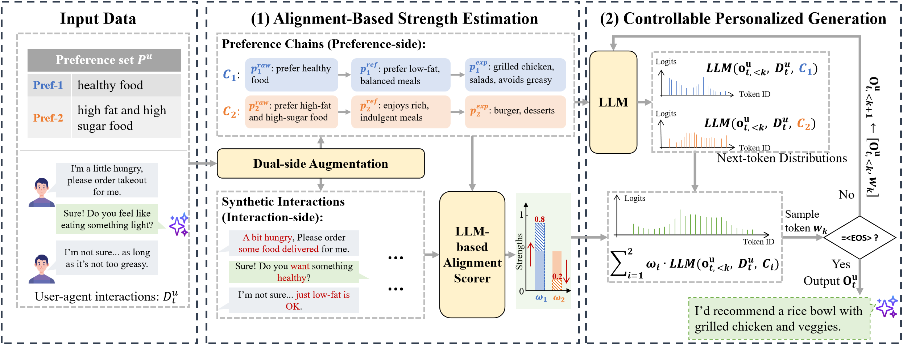

# Adaptive Preference Arithmetic: Modeling Dynamic Preference Strengths for LLM Agent Personalization

Official implementation of **AdaPA-Agent**, a framework for dynamic preference modeling and controllable personalized generation in LLM-based agents.



## Overview

AdaPA-Agent dynamically balances **long-term user preferences** with **short-term contextual intents** through:
- **Alignment-Based Strength Estimation**: Estimates preference strengths using dual-side augmentation and LLM-based scoring
- **Preference Arithmetic**: Combines preference-conditioned LLMs with dynamically estimated weights

## Project Structure

```
AdaPA_Agent/
├── algorithms/          # Core algorithm implementations
│   ├── adapa_agent.py   # Main Agent class
│   ├── strength_estimation.py
│   ├── data_augmentation.py
│   ├── alignment_scorer.py
│   └── prompts.py
├── data/
│   ├── processed/       # JSONL data files
├── models/              # Model configuration guide
└── evaluation/          # Evaluation code
```

## Installation

```bash
git clone https://github.com/your-username/AdaPA_Agent.git
cd AdaPA_Agent
pip install -r requirements.txt
```

### Install Model Arithmetic

For preference arithmetic with local models, install [language-model-arithmetic](https://github.com/eth-sri/language-model-arithmetic):

```bash
git clone https://github.com/eth-sri/language-model-arithmetic.git
cd language-model-arithmetic
pip install -e .
```

## Quick Start

```python
from algorithms import AdaPAAgent

agent = AdaPAAgent(
    api_key="your-api-key",
    api_base="https://api.openai.com/v1/",
    estimation_model="gpt-4o-mini",
    K=3,
    alpha=1.0
)

preferences = [
    "I enjoy psychological thrillers with complex plots",
    "I want something light and fun for tonight"
]
interaction = "User: I'm looking for something entertaining..."

strengths, _ = agent.estimate_preference_strengths(preferences, interaction)
print(f"Strengths: {strengths}")
```

## Evaluation

```bash
cd evaluation
export ADAPA_API_KEY="your-api-key"
./run_evaluation.sh
```

See [models/README.md](models/README.md) for local model configuration.

## Citation

```bibtex
@article{adapa2025,
    title={Adaptive Preference Arithmetic: Modeling Dynamic Preference Strengths for LLM Agent Personalization},
    author={Hongyi Nie, Yaqing Wang, Mingyang Zhou, Quanming Yao, Zhen Wang},
    journal={NeurIPS},
    year={2025}
}
```

## Acknowledgments

- [Language Model Arithmetic](https://github.com/eth-sri/language-model-arithmetic) for the model arithmetic framework
